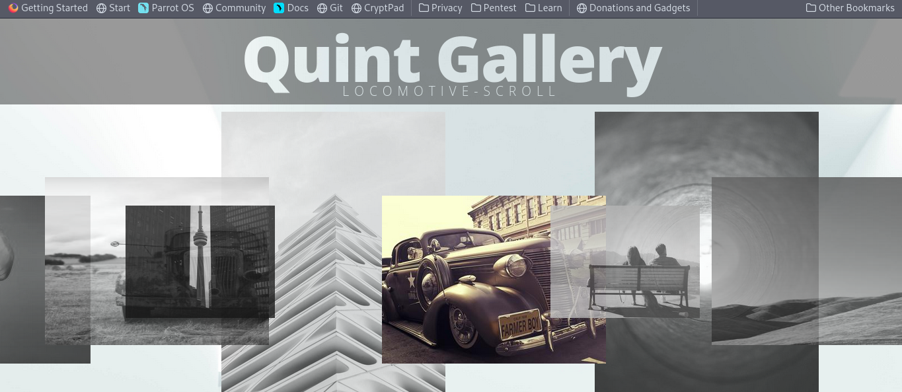

# quint-gallery
A horizontal scroll gallery that displays images in colour when the mouse hovers it

## Screenshots

## Author
- [@quintofsteel](https://www.github.com/quintofsteel)
- The locomotive scroll and SVG text mask were inspired by work done by [Ivan Bogachev](https://codepen.io/sfi0zy/pen/PoGvYyy) and [Marco Barria](https://codepen.io/fixcl/pen/DOoNbN)

## License

